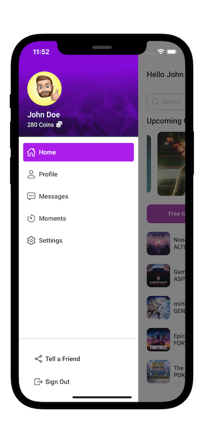
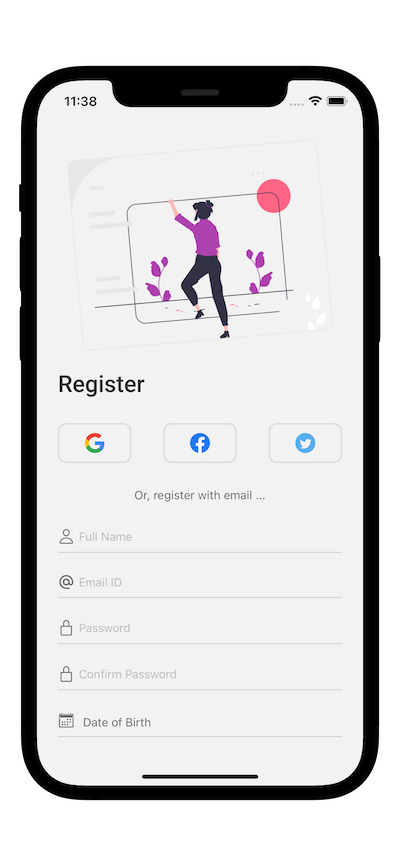

In this project you'll find a game app named Playmax which is a game store including popular and upcoming games made with the help of react native and it's dependencies like React Navigation for navigating between apps.

I have provided some screenshots which i captured through the Android Studio application when running the app.

First page is register or login screen
after login there's an onboarding screen
then, we have the app screen (the homepage)
and a navigation screen to slide.

You can see games and their prices and you can also buy them through the points you earn.

# App Screenshots

